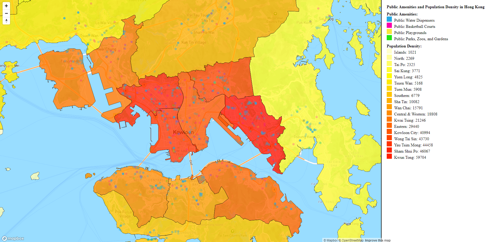

# Lab2

Below is the link to my HTML map for Lab 2 featuring the public amenities and population distribution of Hong Kong!
file:///C:/Users/user/Desktop/mappaexamplefolder/Lab2%20(2).html 

Reflective Analysis:

The map I created focuses on the spread of public amenities and its relation in regard to population distribution with the intention of being able to provide knowledge to the residents of Hong Kong as well as students, researchers, academics, or just the general public for educative and analysis purposes. The questions that the map attempts to raise surround how given the population distribution of Hong Kong - are the current distribution of public amenities making sense? And if not, how can we better improve this to provide greater accessibility to the residents? In retrospect, I believe my map was successful in being able to provide the necessary information needed to further analyze and potentially even answer the specific question my map is looking to unwrap as we are able to make the distinction in being able to analyze the distribution of population spread and how those can tie in to the overall accessibility of the public amenities highlighted. However, I do think that my map failed in the regard of being able to potentially being able to uncover an even deeper layer of analysis as well as failing to successfully create a more aesthetically pleasing visualization. When creating the map and when considering the intellectual justifications for the choices made, when it came to data, I wanted to put my focus on analyzing set of information based on a location of interest that I could relate to. With that being said, I decided on Hong Kong. With Hong Kong being an extremely populated and dense city, it definitely poses pros and cons. However, I have always been curious about not just the population density but also the spread of its more populated public amenities and how these can relate to any accessibility patterns identified. From this point, I followed the more standard and traditional route observed in class of data collection and visualizing planning on how to best portray the information being presented. Regarding cartograpphic styling and the decisions behind that, my priority was functionality and for users to be able to interact directly with the map to obtain information needed. I wanted to place my legend at the bottom of the map but was having a hard time coding all the labels from the population distribution on a horizontal 3x6 format and so I decided to create a column instead along the right of the map where I was able to stack all the labels on top in an organized fashion. I initially also wanted to have a scroll bar rather than scroll buttons but after looking around at some other examples and more established web maps - I decided that buttons offered a clean and minimalist engagement which I typically was leaning more towards in the moment. 
In terms of interactivity, my map provides a zoom and a map rotation function that allows users to engage directly with the coordinates, viewing, and angles of the map that was created on Notepad++. In addition, my map provides a visualize interaction with the user that changes the opacity of both the choropleth filter surrounding population density as well as of the public amenities based on the level of zoom that the user decides to select. Through these functions, the map above allows users to directly facilitate the proportions of the map in order to obtain and analyze data specific to their interest. 

There are many ways my map can be improved, that's for sure. Firstly, the visual aesthetic and how it is presented can be revamped to a more professional and sleek interface that can create a more visually appealing experience for the user. Secondly, I also do think as mentioned, I can peel an extra layer in taking a deeper dive in the analysis. I ultimately wanted to experiment with roads and transportation as well but as mentioned, my priority was functionality and making sure I could understand how to not only properly display the data but also provide smooth functionality for the user's experience.
